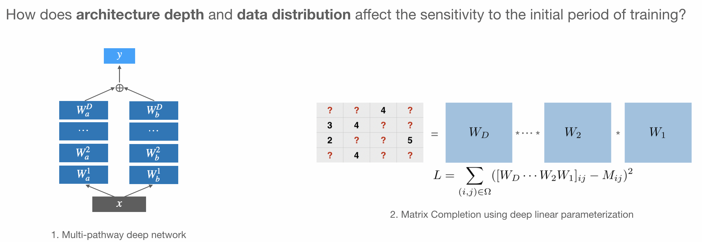

# Critical Periods Emerge Even in Deep Linear Networks

Official Pytorch Implementation for [Critical Periods Emerge Even in Deep Linear Networks (ICLR 2024)](https://openreview.net/pdf?id=Aq35gl2c1k) .



## Quick Start

Our code is organized into two repositiories: `multipath` and `matrixcompletion`.
Each repository contains a `README.md` file with instructions on how to reproduce the results in the paper.

## Requirements

- python 
- torch
- numpy
- scipy
- matplotlib
- pyyaml
- seaborn 

## Acknowledgements

This repository builds off: 
- https://github.com/roosephu/deep_matrix_factorization
- https://github.com/AllenInstitute/Multipathway_NeurIPS2022

---
If you find this useful for your work, please consider citing
```
@inproceedings{
kleinman2024critical,
title={Critical Learning Periods Emerge Even in Deep Linear Networks},
author={Michael Kleinman and Alessandro Achille and Stefano Soatto},
booktitle={The Twelfth International Conference on Learning Representations},
year={2024},
url={https://openreview.net/forum?id=Aq35gl2c1k}
}
```
